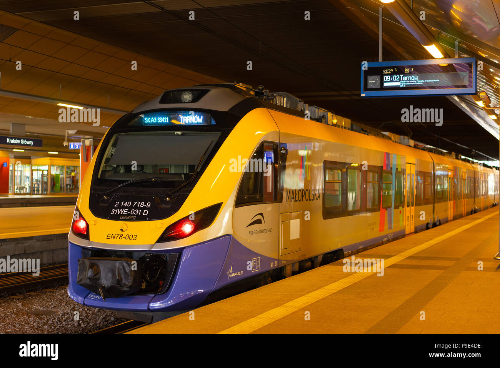

# Cracow Public Transport Project

## Introduction

Public transport in Cracow is one of the most efficient and eco-friendly systems in Poland. It consists of an extensive network of trams and buses connecting almost every part of the city. The system is managed by MPK Kraków and is known for its punctuality, modern vehicles, and integration with regional lines.

The main goal of this project is to present and analyze selected aspects of public transport in Cracow. The data focuses on the most popular routes, types of vehicles, and travel times between key city areas. This helps both residents and tourists understand the structure and efficiency of the city’s transportation network.

Public transport in Cracow continues to evolve with new eco-friendly solutions, such as electric buses and trams with energy recovery systems. The city aims to reduce carbon emissions and promote sustainable travel options, making it a model for other urban centers in Poland and Europe.

---

## Data

The table below contains sample data about selected tram and bus lines in Cracow.  
It includes the line number, type of vehicle, route, and average travel duration.

| Line    | Type     | Route                                      | Duration (min)  |
|---------|----------|--------------------------------------------|-----------------|
| 152     | Bus      | Os. Podwawelskie - Airport                 | 45              |
| 179     | Bus      | Krowodrza Górka - Kurdwanów                | 40              |
| 4       | Tram     | Bronowice Małe - Wzgórza Krzesławickie     | 50              |

---

## Images

[Tram in Cracow](https://upload.wikimedia.org/wikipedia/commons/thumb/9/9d/Krk_bombardier_ngt6_2037_filharmonia.jpg/330px-Krk_bombardier_ngt6_2037_filharmonia.jpg)

[Bus in Cracow](https://www.shutterstock.com/image-photo/cracow-poland-april-25-2018-260nw-1109630087.jpg)

---

## TEAM

1. **Łukasz Woś**  
   GitHub: [@lukkiwos](https://github.com/lukkiwos)  
   Tasks: 1, 6

2. **Dominik Słomka**  
   GitHub: [@Dominik4322](https://github.com/Dominik4322)  
   Tasks: 2, 3

3. **Adrian Uchacz**  
   GitHub: [@Avarez2137](https://github.com/Avarez2137)  
   Tasks: 4, 5

---
